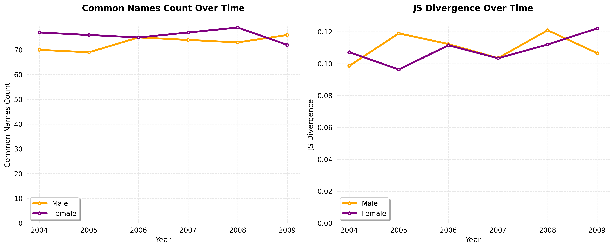
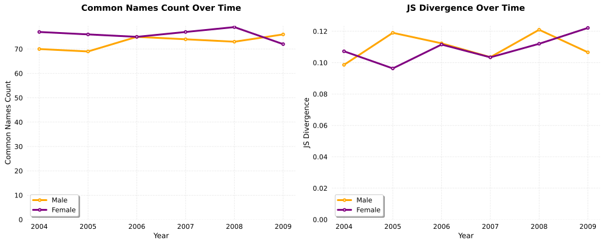
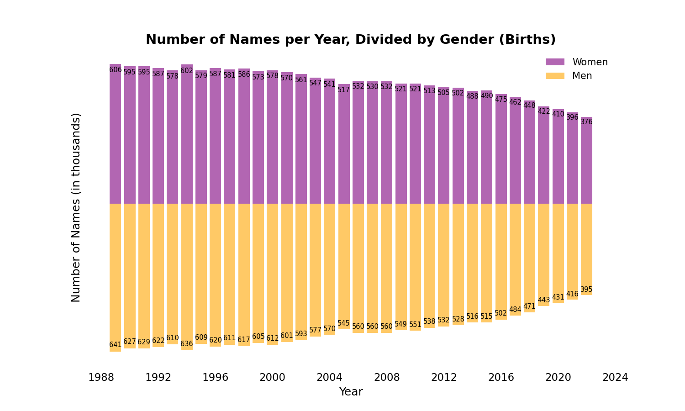
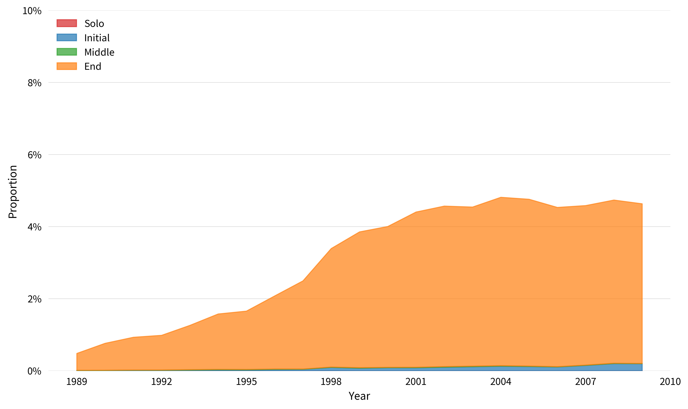
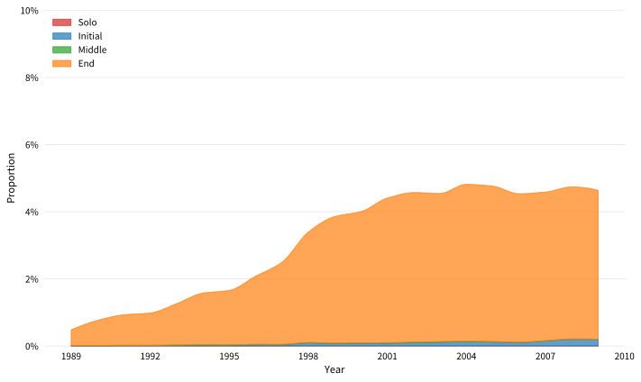

# Book Figures Index

## Figure 1: Similarity of the Meiji Yasuda data and Heisei Namae Jiten data

## Figure 2: Number of names per year, divided by gender (Births)

## Figure 17: Emergence of 斗 in boys’ names (Heisei Namae Jiten data)

