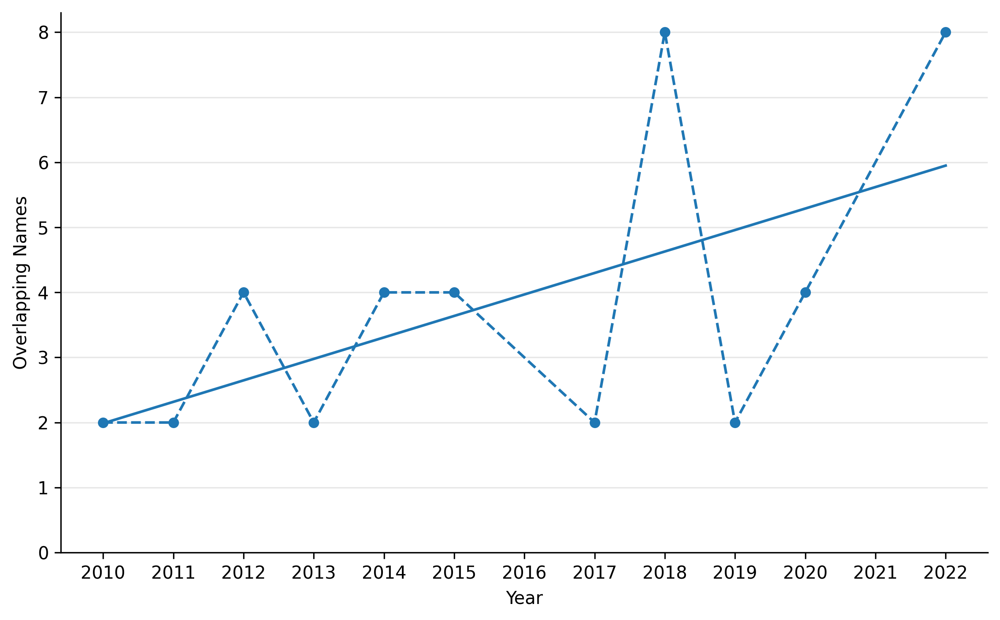
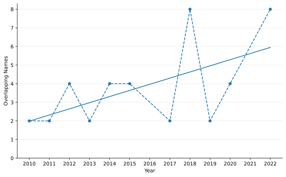

# Book Figures Index

## Figure 10: Phonological and graphic overlap in boys’ and girls’ names

| PNG | SVG |
| --- | --- |
|  |  |

## Figure 13A: Overlap trend in the top 50 Meiji Yasuda names (phonological forms)

| Manuscript | PNG | SVG |
| --- | --- | --- |
|  |  |  |

## Figure 13B: Overlap trend in the top 50 Meiji Yasuda names (phonological forms)

| Manuscript | PNG | SVG |
| --- | --- | --- |
|  |  |  |

## Figure 14A: Overlap trend in the top 100 Meiji Yasuda names (graphic forms)

| Manuscript | PNG | SVG |
| --- | --- | --- |
|  |  |  |

## Figure 14B: Overlap trend in the top 100 Meiji Yasuda names (graphic forms)

| Manuscript | PNG | SVG |
| --- | --- | --- |
|  |  |  |

## Figure 15A: Overlap trend in the top 500 Heisei Namae names (graphic forms)

| Manuscript | PNG | SVG |
| --- | --- | --- |
|  |  |  |

## Figure 15B: Overlap trend in the top 500 Heisei Namae names (graphic forms)

| Manuscript | PNG | SVG |
| --- | --- | --- |
|  |  |  |

## Figure 16: Gender-neutral names (F-ratio ∈ [0.2, 0.8]) in the Heisei Namae Jiten data

| Manuscript | PNG | SVG |
| --- | --- | --- |
|  |  |  |
