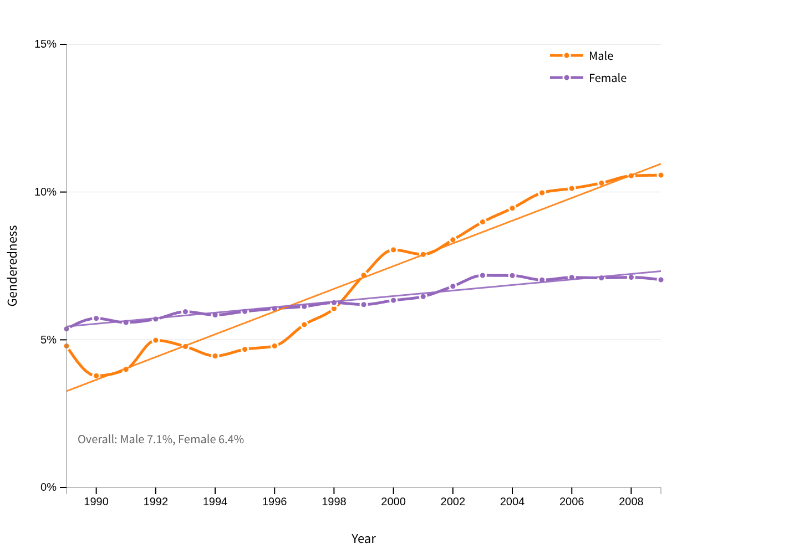
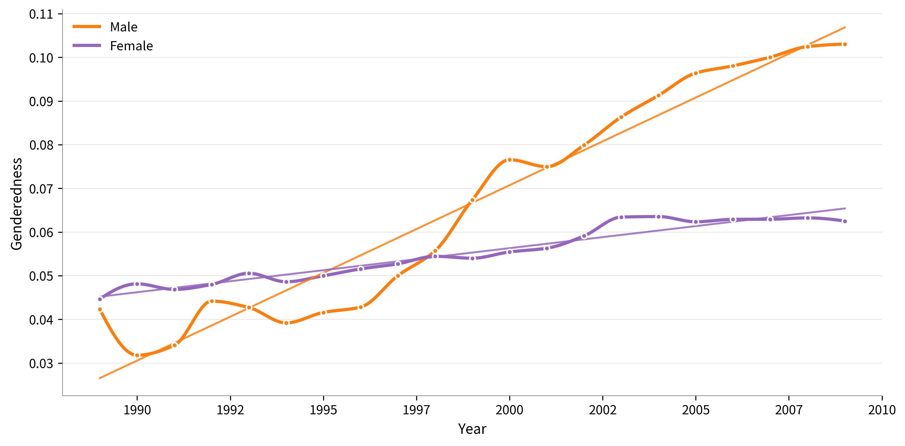
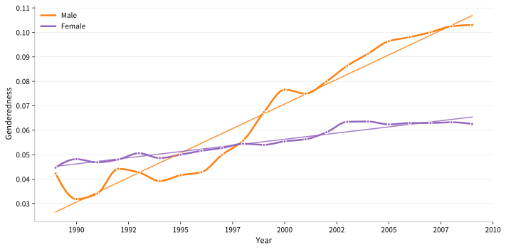
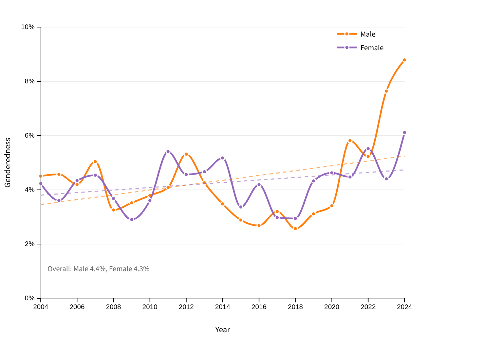
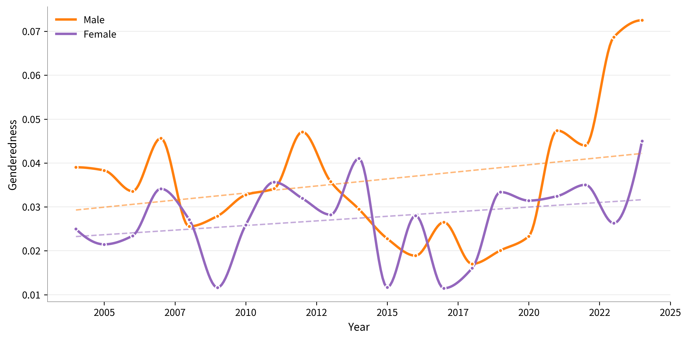
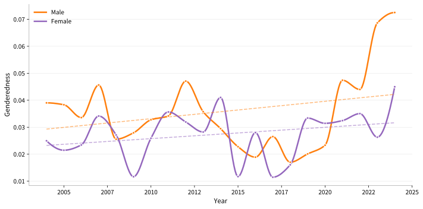
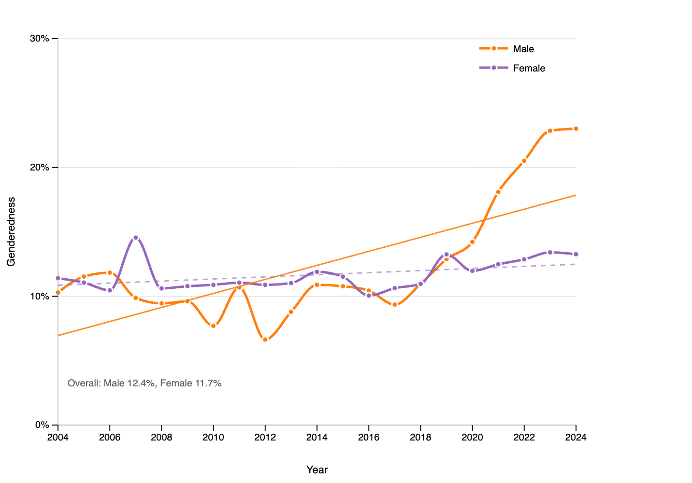
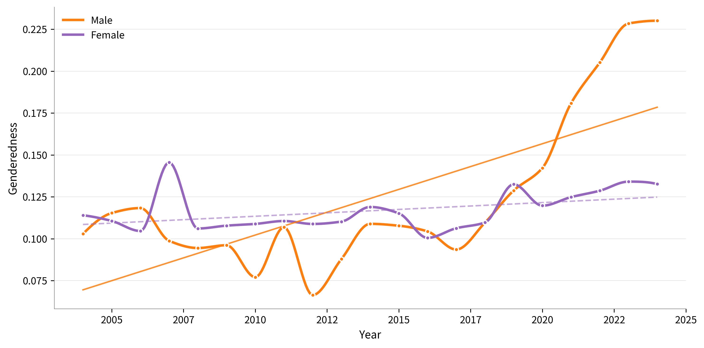

# Book Figures Index

## Figure 7AA

## Figure 7AB

## Figure 7AC

## Figure 7AD

## Figure 7BA

## Figure 7BB

## Figure 7BC

## Figure 7BD

## Figure 7CA

## Figure 7CB

## Figure 7CC

## Figure 7CD

## Figure 8A: Diversity measures for the Heisei Namae Jiten data

## Figure 8B: Diversity measures for the Heisei Namae Jiten data

## Figure 8C: Diversity measures for the Heisei Namae Jiten data

## Figure 8D: Diversity measures for the Heisei Namae Jiten data

## Figure 9: Distribution of irregular readings in the Baby Calendar database

| Manuscript | PNG | SVG |
| --- | --- | --- |
|  |  |  |

## Figure 21A: Change in genderedness for Heisei Namae Jiten data

| Manuscript | PNG | SVG |
| --- | --- | --- |
|  |  |  |

## Figure 21B: Change in genderedness for Meiji Yasuda data (top 100 graphic)

| Manuscript | PNG | SVG |
| --- | --- | --- |
|  |  |  |

## Figure 21C: Change in genderedness for Meiji Yasuda data (top 50 phonological)

| Manuscript | PNG | SVG |
| --- | --- | --- |
|  |  |  |
